# Ricoh Theta X - 3D-printed accessories
### Version 1.1

A 3D-printed lens cover, 3D-printed base stand and a variant that mounts onto a Benro selfie stick for the Ricoh Theta X camera.

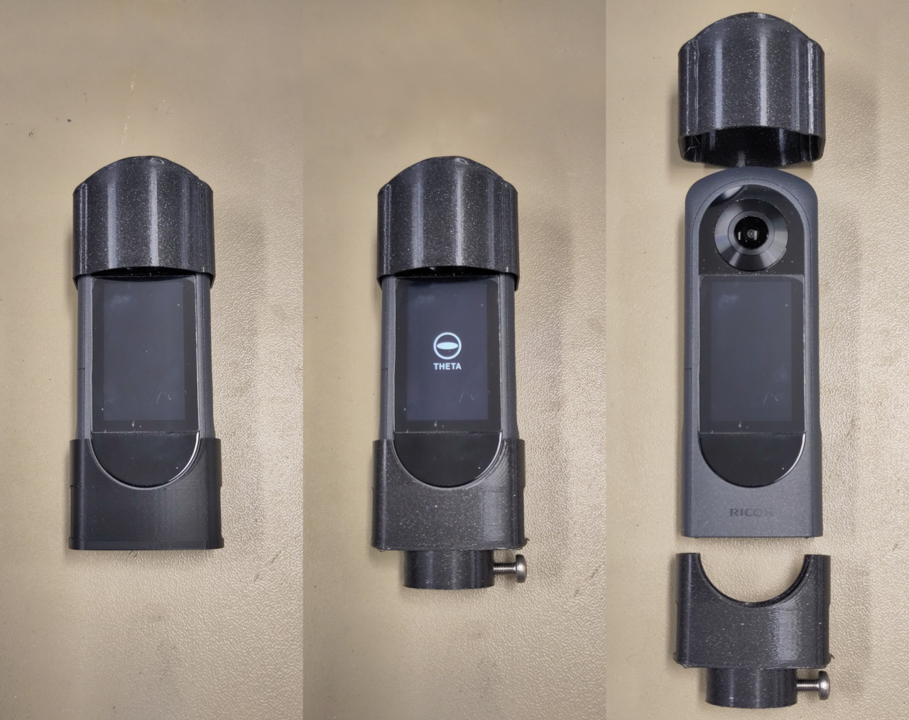
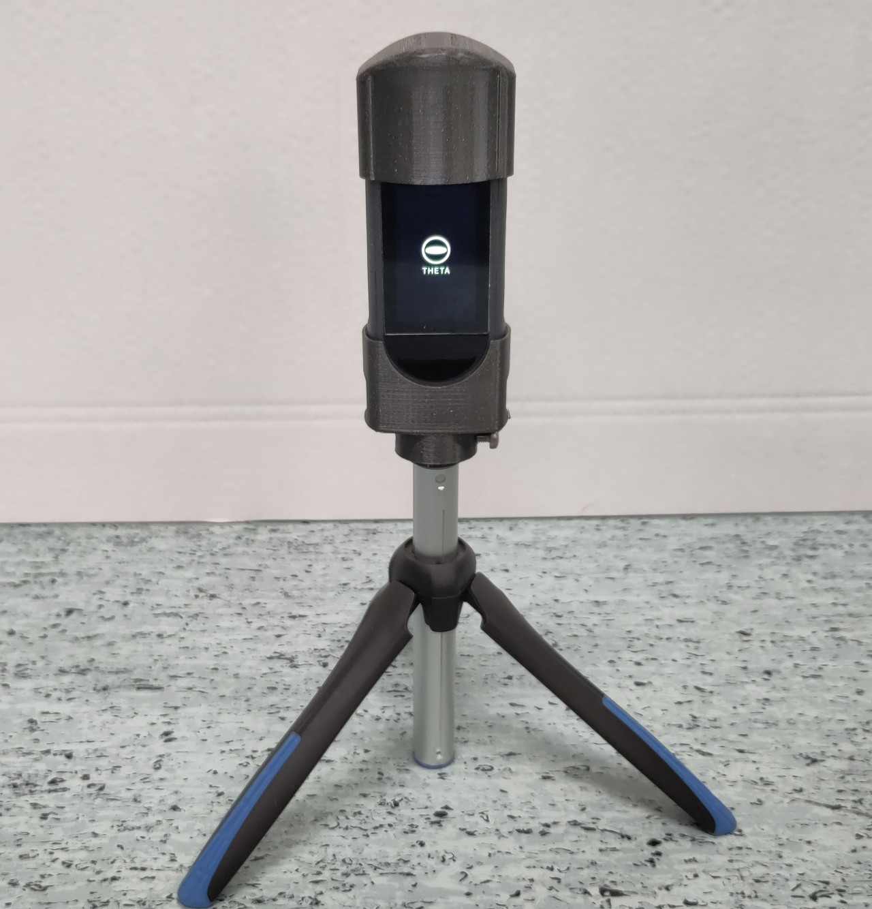
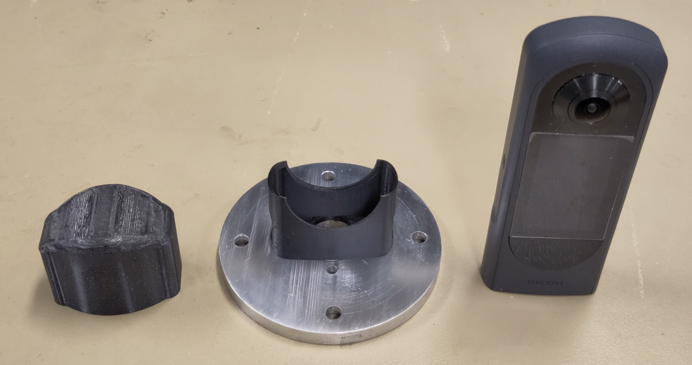

https://github.com/user-attachments/assets/2581c1f3-8a20-4212-920c-432def58eb03

* [Files](#files)
* [Assembly](#assembly)

## Files

### Lens cover

#### Version for the naked camera

A lens cover to protect the Ricoh Theta X's delicate fisheye lenses.

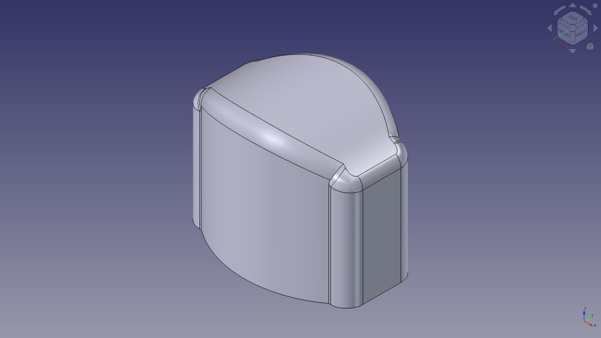

- [FreeCAD model for the lens cover](ricoh_theta_x_lens_cover.FCStd)
- [STEP model for the lens cover](ricoh_theta_x_lens_cover.step)

#### Version for the camera with Puluz lens guards installed

The Ricoh Theta X can be equipped with [Puluz lens guard](https://www.puluz.com/p/PU590T/PULUZ-Lens-Guard-PC-Protective-Cover-Kits-for-Ricoh-Theta-SC2-S-V-Transparent-.htm). They're designed for the Ricoh Theta SC2, S or V cameras, and in theory, they're too small for the Ricoh Theta X's lenses. But in practice, they work quite well.

Of course, the Puluz lens guards bulge out too much for the regular lens cover. So here's a wider version of the lens cover that can accommodate them.

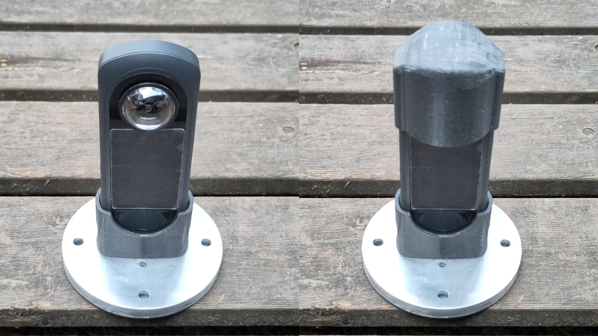

- [FreeCAD model for the lens cover for the camera with Puluz lens guards installed](ricoh_theta_x_lens_cover_with_puluz_lens_guards.FCStd)
- [STEP model for the lens cover for the camera with Puluz lens guards installed](ricoh_theta_x_lens_cover_with_puluz_lens_guards.step)

### Base

A base that holds the Ricoh Theta X camera upright firmly. May be mounted onto any surface with two countersunk head M3 screws.

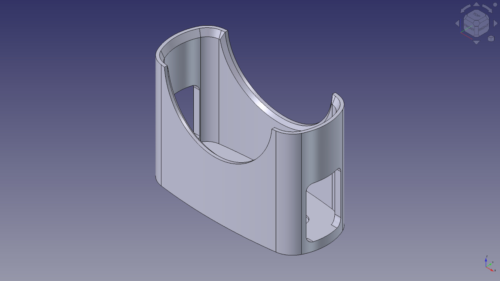

- [FreeCAD model for the base](ricoh_theta_x_base.FCStd)
- [STEP model for the base](ricoh_theta_x_base.step)

### Base with Benro selfie stick mount

A universal base stand that holds the Ricoh Theta X camera upright firmly, designed to replace the head of a [Benro BK15 mini tripod and selfie stick](https://benrousa.com/mini-tripod-and-selfie-stick-with-remote-for-smartphones-black-bk15/).

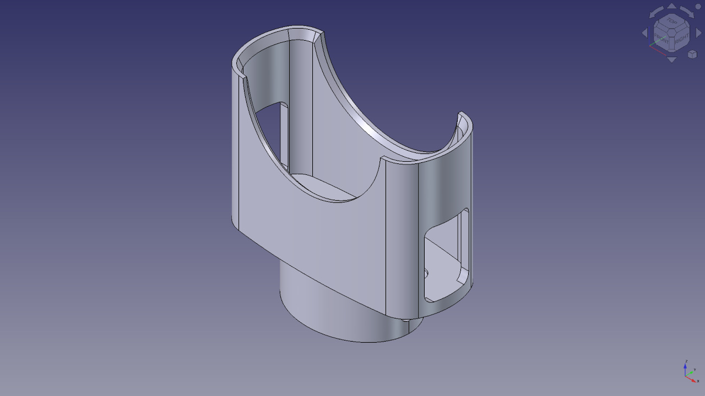

- [FreeCAD model for the base with Benro selfie stick mount](ricoh_theta_x_base_with_benro_selfie_stick_mount.FCStd)
- [STEP model for the base with Benro selfie stick mount](ricoh_theta_x_base_with_benro_selfie_stick_mount.step)

## Assembly

### Base

This base stand can be screwed onto any surface or heavy object to turn it into a secure base for the Ricoh Theta X camera. The surface only needs 2 threaded M3 holes 35mm apart - or straight 3mm-diameter holes if you use nuts - for the countersunk head M3 screws.

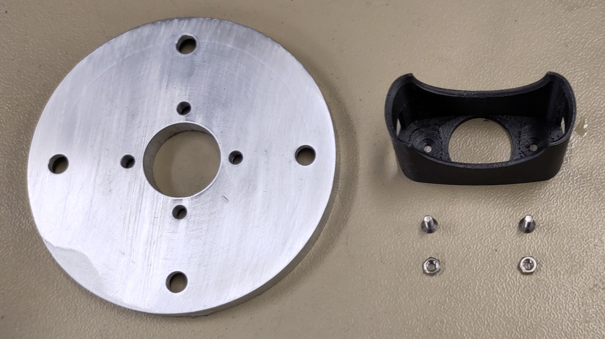
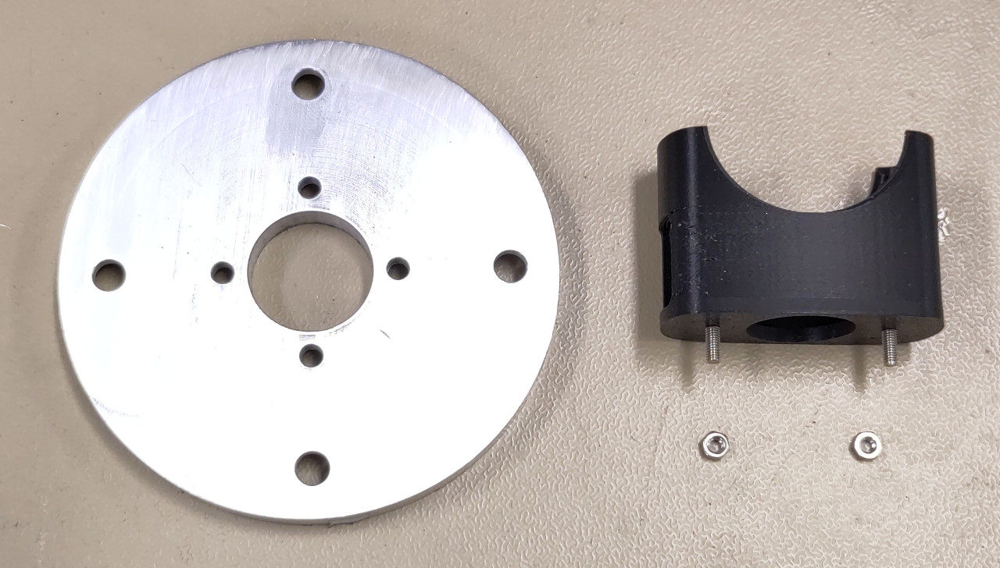
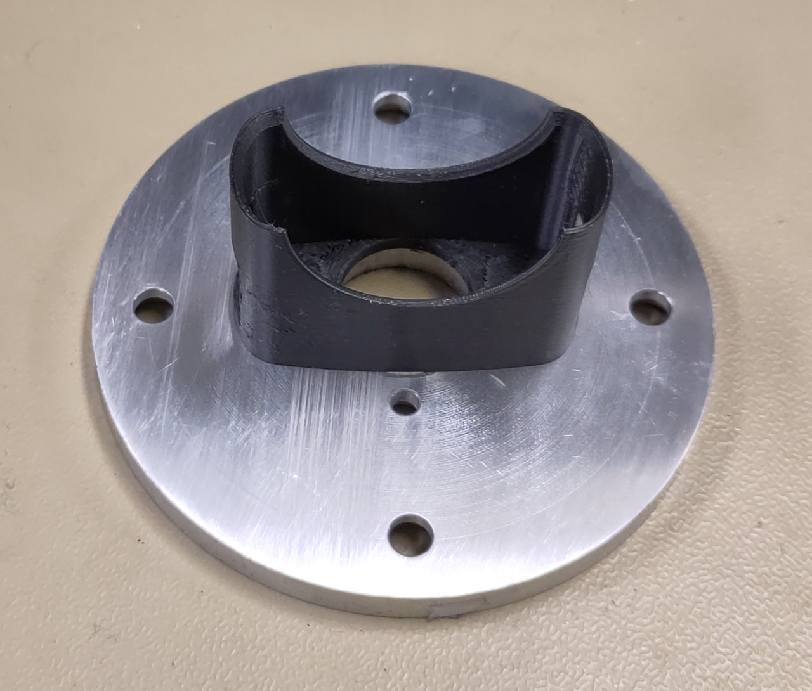

### Base with Benro selfie stick mount

- Unscrew the stock swiveling head fully and detach it from the end of the selfie stick

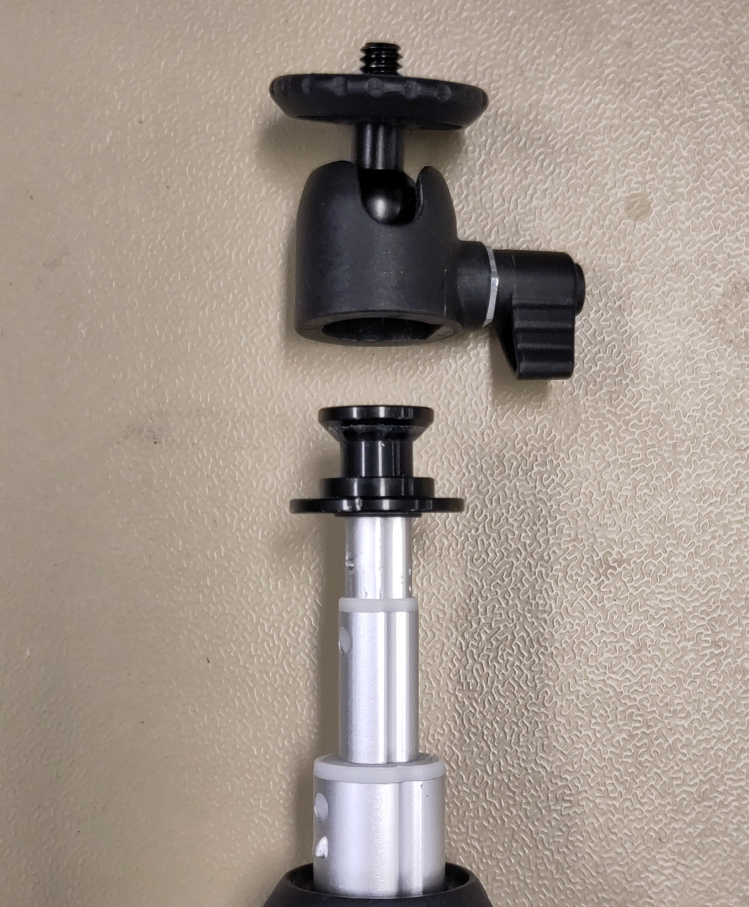

- Slip the base onto the end of the selfie stick

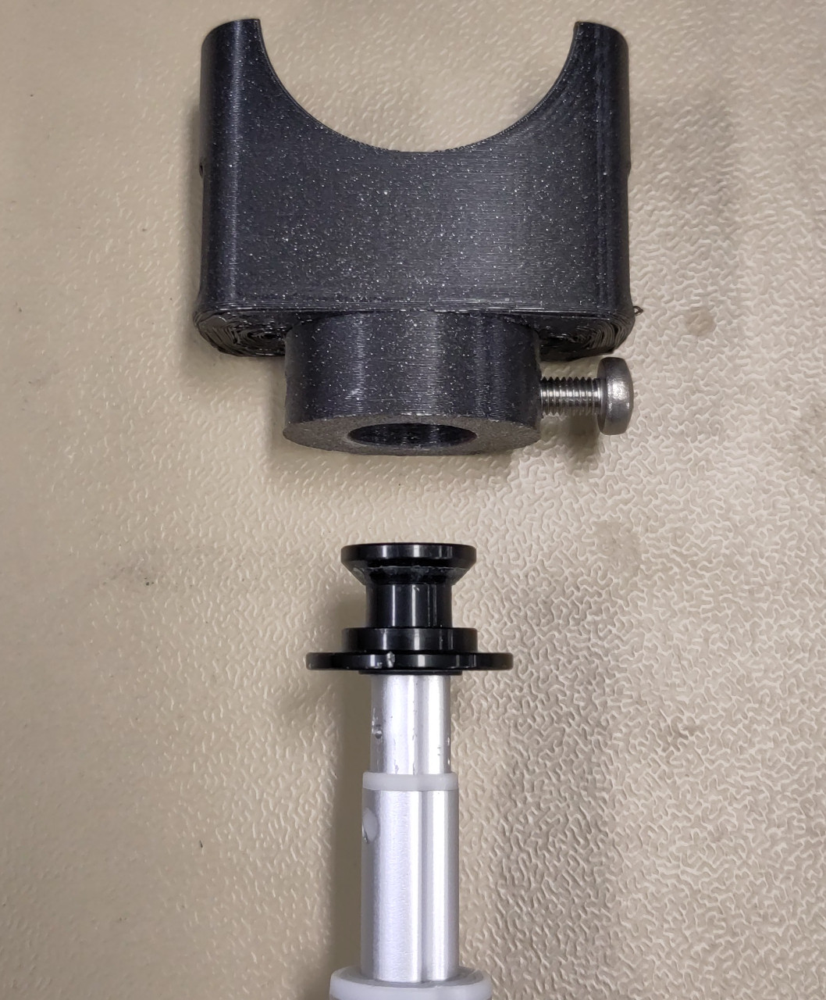

- Lock the base in place with a 5mm screw

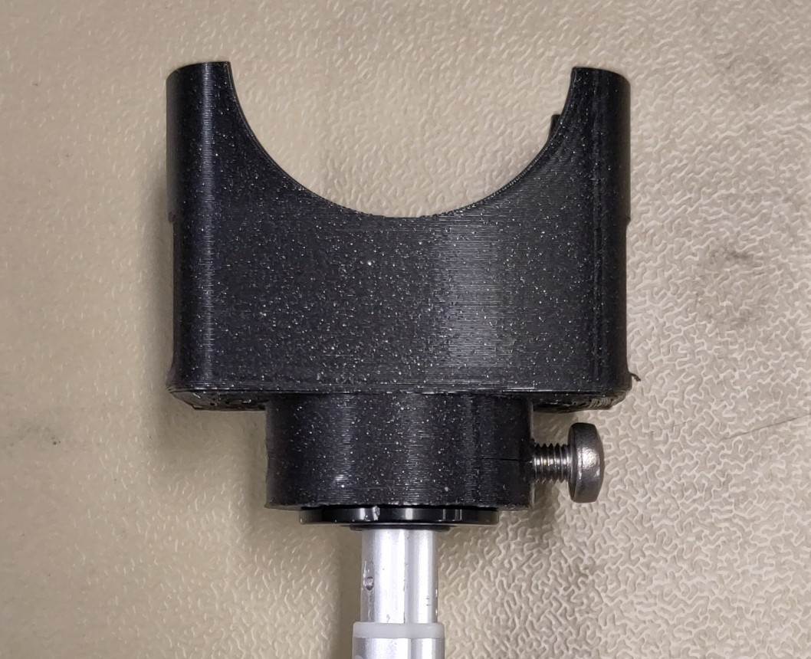
