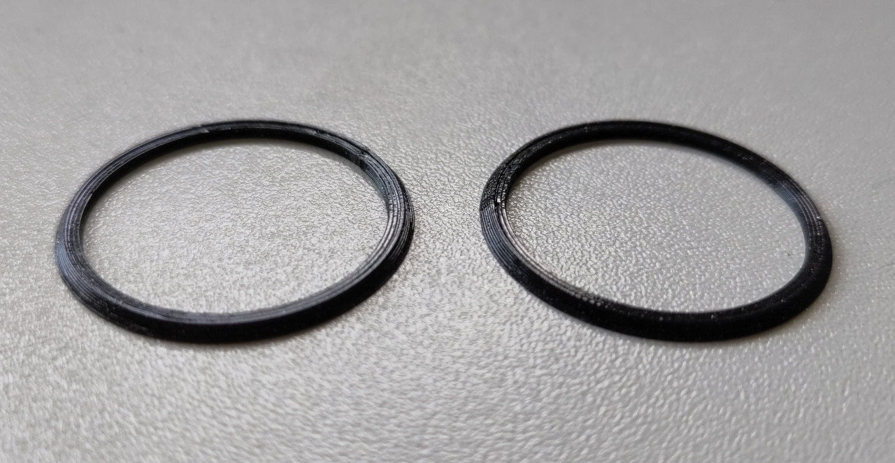
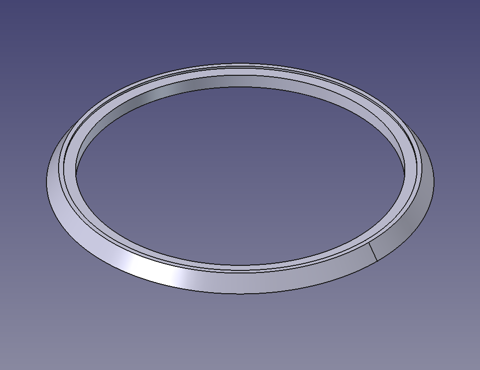
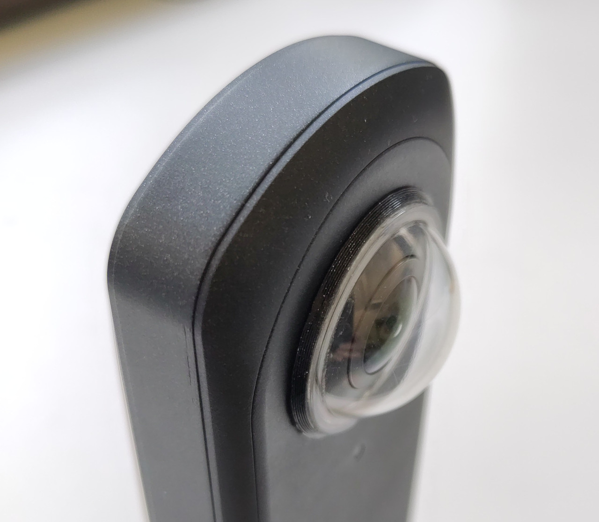
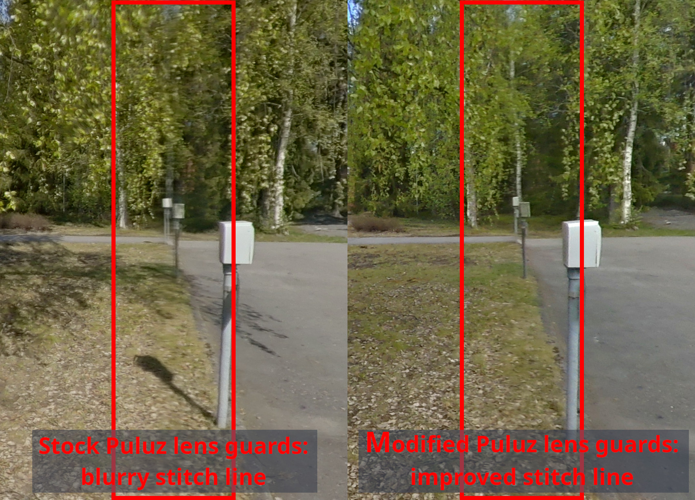
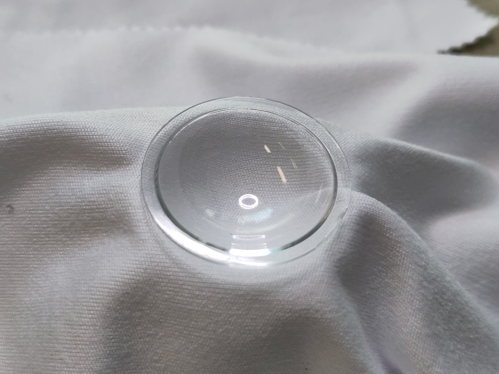
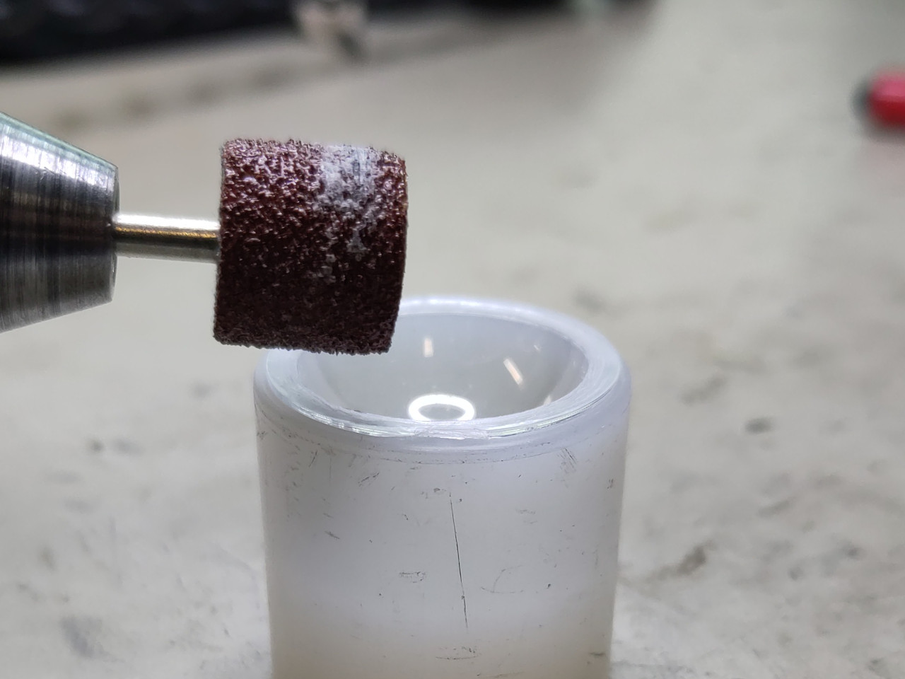
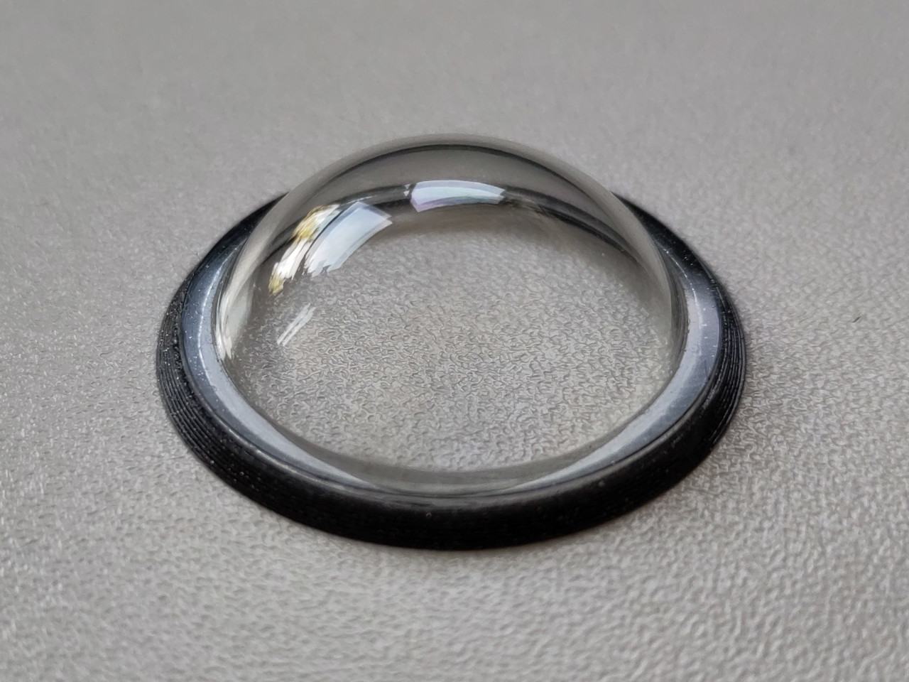
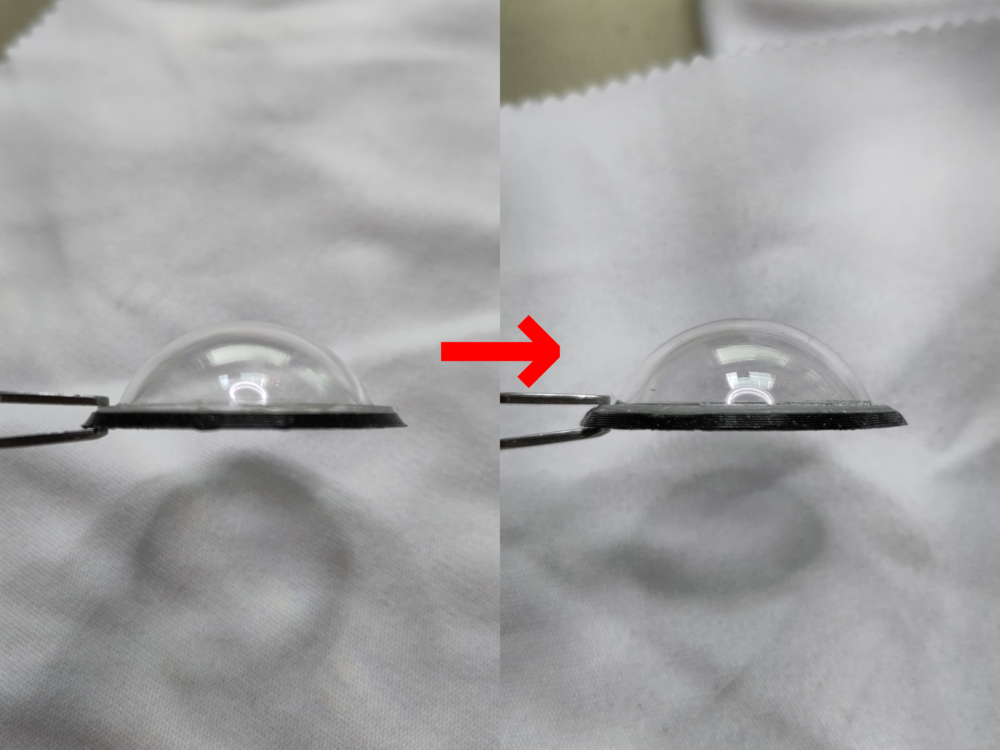

# Ricoh Theta X - 3D-printed accessories
### Version 1.1

A 3D-printed lens cover, 3D-printed base stand and a variant that mounts onto a Benro selfie stick for the Ricoh Theta X camera.

https://github.com/user-attachments/assets/2581c1f3-8a20-4212-920c-432def58eb03

* [Files](#files)
* [Assembly](#assembly)

## Files

### Lens cover

#### Version for the naked camera

A lens cover to protect the Ricoh Theta X's delicate fisheye lenses.

- [FreeCAD model for the lens cover](ricoh_theta_x_lens_cover.FCStd)
- [STEP model for the lens cover](ricoh_theta_x_lens_cover.step)

#### Version for the camera with Puluz lens guards installed

The Ricoh Theta X can be equipped with [Puluz lens guards](https://www.puluz.com/p/PU590T/PULUZ-Lens-Guard-PC-Protective-Cover-Kits-for-Ricoh-Theta-SC2-S-V-Transparent-.htm). They're designed for the Ricoh Theta SC2, S or V cameras, and in theory, they're too small for the Ricoh Theta X's lenses. But in practice, they work quite well (but can be made to work better with the Theta X - see below).

Of course, the Puluz lens guards bulge out too much for the regular lens cover. So here's a wider version of the lens cover that can accommodate them.

1
- [FreeCAD model for the lens cover for the camera with Puluz lens guards installed](ricoh_theta_x_lens_cover_with_puluz_lens_guards.FCStd)
- [STEP model for the lens cover for the camera with Puluz lens guards installed](ricoh_theta_x_lens_cover_with_puluz_lens_guards.step)

### Base

A base that holds the Ricoh Theta X camera upright firmly. May be mounted onto any surface with two countersunk head M3 screws.

- [FreeCAD model for the base](ricoh_theta_x_base.FCStd)
- [STEP model for the base](ricoh_theta_x_base.step)

### Base with Benro selfie stick mount

A universal base stand that holds the Ricoh Theta X camera upright firmly, designed to replace the head of a [Benro BK15 mini tripod and selfie stick](https://benrousa.com/mini-tripod-and-selfie-stick-with-remote-for-smartphones-black-bk15/).

- [FreeCAD model for the base with Benro selfie stick mount](ricoh_theta_x_base_with_benro_selfie_stick_mount.FCStd)
- [STEP model for the base with Benro selfie stick mount](ricoh_theta_x_base_with_benro_selfie_stick_mount.step)

### Puluz lens guard adapter ring

The [Puluz lens guards](https://www.puluz.com/p/PU590T/PULUZ-Lens-Guard-PC-Protective-Cover-Kits-for-Ricoh-Theta-SC2-S-V-Transparent-.htm) are designed for the Ricoh Theta SC2, S or V cameras, which have smaller lenses / lens bases than the Theta X. While they work on the Theta X, they're not ideal, for the following reasons:

- They're in contact with the conical lens bases of the Theta X only on the inner edge of the lens guards, which isn't a lot of surface for the double-face adhesive to grab onto.
- Because the flat bottoms of the lens guards don't rest on the surface of the camera around the lens bases, they don't sit low enough, and the very edges of the lens guards tend to blur the stitch line a bit.
- They're not removable - although that's a limitation of the lens guards themselves.

The Puluz lens guards can be modified so they sit a bit lower on the lens, gluing this 3D-printed adapter ring onto the base of each lens guard to clip onto the edge of the Theta X's lens base, so they stay in place by friction alone, making the lens guards removable.

- [FreeCAD model for one Puluz lens guard adapter ring](ricoh_theta_x_puluz_lens_guard_adapter_ring.FCStd)
- [STEP model for one Puluz lens guard adapter ring](ricoh_theta_x_puluz_lens_guard_adapter_ring.step)

## Assembly

### Base

This base stand can be screwed onto any surface or heavy object to turn it into a secure base for the Ricoh Theta X camera. The surface only needs 2 threaded M3 holes 35mm apart - or straight 3mm-diameter holes if you use nuts - for the countersunk head M3 screws.

### Base with Benro selfie stick mount

- Unscrew the stock swiveling head fully and detach it from the end of the selfie stick

- Slip the base onto the end of the selfie stick

- Lock the base in place with a 5mm screw

### Puluz lens guard adapter ring

- Adjust the fit of the ring onto the lens base: it should fit around the edge of the base with just enough friction to stay in place, but not so much that force is required to remove it with a blade. If it's a bit too tight, gently sand down the inner surface of the ring with 800-grit sandpaper. If it won't fit or it's too loose, adjust the diameter in 0.02 mm increments and reprint it (it takes only a couple of minute)

- peel off the black double face adhesive front and rear of the lens guard's lip.

- With a Dremel, bevel the inner edge of the lens guard 15/20 degrees inward as deep as possible, but not so deep as to separate the lens guard's lip off the domed part. The idea is to let the lens guard sit as low as possible on the lens base.

- Glue the lens guard onto the adapter ring. Use as little glue as possible around the adapter's groove. Prefer epoxy (such as Araldite 2012) to superglue, to avoid clouding the lens guard with cyanoacrylate fumes, and to have enough time to position the lens guard onto the adapter ring properly.

- With a Dremel, chamfer the outer edge of the lens guard all around, to open up the fisheye lens' field of view around the edge of the image as much as possible, to avoid stitch line artifacts as much as possible.

